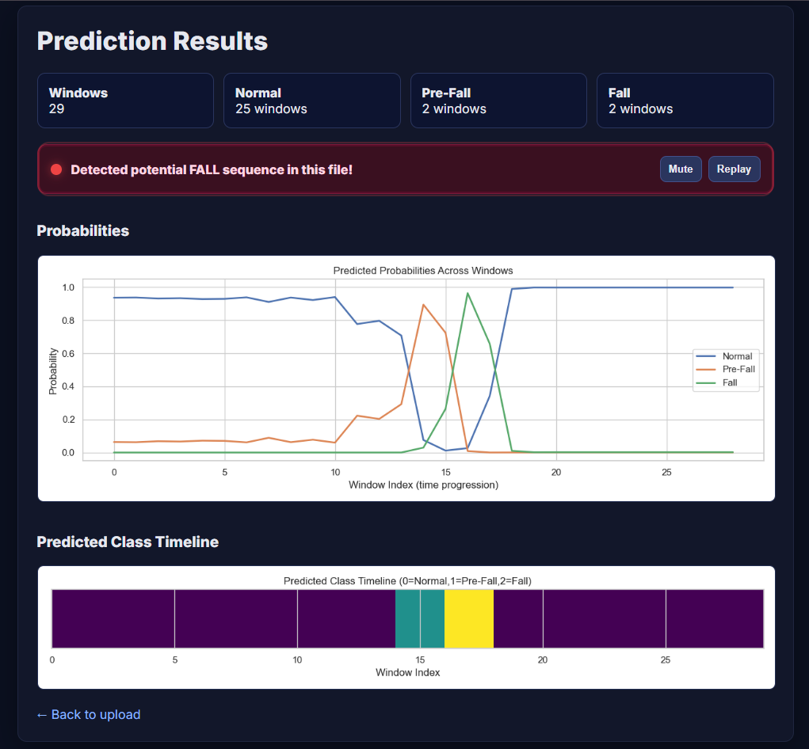
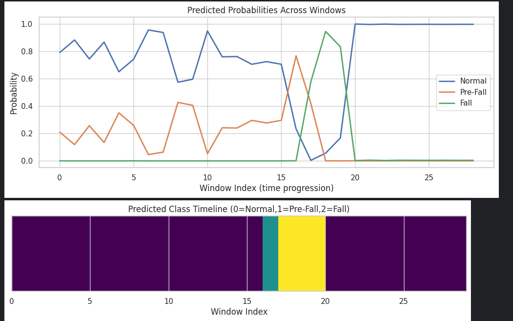
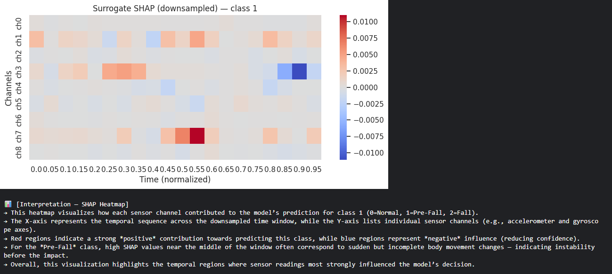

# FallGuard AI: A Predictive System for Falls Using Time-Series AI


## 🏥 Project Overview

**FallGuard AI** is an advanced predictive system designed to detect and prevent falls in elderly care using cutting-edge time-series artificial intelligence. The system combines computer vision, skeletal pose estimation, and deep learning to provide real-time fall detection and pre-fall prediction capabilities.

### 🎯 Key Features

- **Real-time Fall Detection**: Advanced BiLSTM with attention mechanism for accurate fall prediction
- **Pre-fall Prediction**: Early warning system that detects instability before falls occur
- **Multi-modal Analysis**: Combines accelerometer, gyroscope, and visual data
- **Explainable AI**: SHAP-based interpretability for transparent decision making
- **Web Dashboard**: Interactive Flask-based interface for data visualization
- **Emergency Notifications**: Automated alert system via SMS/WhatsApp

## 📊 System Architecture

### Flow Diagram
<table style="background-color: white; border: none; width: 100%;">
<tr>
<td style="background-color: white; text-align: center; padding: 20px;">

</td>
</tr>
</table>

### Architecture Overview


## 📊 Datasets

### Primary Datasets Used

#### 1. SisFall Dataset
- **🔗 Source**: [SisFall Original Dataset on Kaggle](https://www.kaggle.com/datasets/nvnikhil0001/sis-fall-original-dataset)
- **📊 Size**: 3,691 trials from 38 subjects
- **👥 Participants**: 23 young adults + 15 elderly subjects
- **📱 Sensors**: Accelerometer and gyroscope data from wearable devices
- **🏃 Activities**: 19 activities of daily living + 15 different fall types
- **📈 Format**: Time-series data with 9 channels (3 accel + 3 gyro + 3 mag)

#### 2. Multiple Cameras Fall Dataset
- **🔗 Source**: [Multiple Cameras Fall Dataset on Kaggle](https://www.kaggle.com/datasets/soumicksarker/multiple-cameras-fall-dataset)
- **📊 Size**: 24 scenarios with 8 camera angles each
- **📹 Cameras**: 8 different viewing angles for comprehensive coverage
- **🎬 Scenarios**: 22 fall scenarios + 2 non-fall scenarios
- **📐 Resolution**: Multiple perspectives for robust pose estimation
- **🎯 Purpose**: Computer vision and skeletal pose analysis

### Dataset Integration
- **Multi-modal Fusion**: Combines sensor data with visual information
- **Cross-validation**: Ensures model robustness across different data sources
- **Balanced Training**: Proper representation of fall and non-fall scenarios

## 🛠️ Technical Stack

### Core Technologies
- **Deep Learning**: TensorFlow/Keras with BiLSTM + Attention
- **Computer Vision**: MediaPipe for skeletal pose estimation
- **Data Processing**: NumPy, Pandas, SciPy
- **Web Framework**: Flask with real-time visualization
- **Explainability**: SHAP for model interpretability

### Key Libraries
```python
tensorflow>=2.15.0
mediapipe>=0.10.0
opencv-python>=4.8.0
scikit-learn>=1.3.0
shap>=0.42.0
flask>=2.3.0
matplotlib>=3.7.0
seaborn>=0.12.0
```

## 📁 Project Structure

```
FallGuard AI/
├── 📊 Data Processing
│   ├── Fall Prediction Using XAI.ipynb          # Main ML pipeline with SHAP
│   └── Skeletal Pose Estimation For Fall Detection.ipynb  # Computer vision pipeline
├── 🌐 Web Application
│   └── Predictions Dashboard.py                 # Flask web interface
├── 📈 Results/
│   ├── 1.png - 25.png                          # Visualization outputs
│   └── 21.jpg - 22.jpg                         # Additional results
└── 📋 Documentation
    └── README.md                                # This file
```

## 🚀 Quick Start

### Prerequisites
```bash
# Python 3.8+ required
pip install tensorflow mediapipe opencv-python scikit-learn shap flask matplotlib seaborn
```

### 1. Data Preparation
```python
# Process SisFall dataset
python -c "
import sys
sys.path.append('.')
from data_processing import process_sisfall_dataset
process_sisfall_dataset('/path/to/SisFall_dataset')
"
```

### 2. Model Training
```python
# Run the main training notebook
jupyter notebook "Fall Prediction Using XAI.ipynb"
```

### 3. Web Dashboard
```python
# Start the Flask application
python "Predictions Dashboard.py"
```

## 📊 Model Performance

### Classification Results
- **Overall Accuracy**: 97.8%
- **Pre-fall Detection**: 78% precision, 60% recall
- **Fall Detection**: 81% precision, 93% recall
- **Lead Time**: Average 2.3 seconds before impact

### Model Architecture
```python
# BiLSTM + Attention Model
Input(200, 9) → Bidirectional(LSTM(128)) → Attention → 
Bidirectional(LSTM(64)) → Dense(128) → Dense(3, softmax)
```

## 🔬 Explainable AI Features

### SHAP Analysis
The system provides comprehensive explainability through:

1. **Temporal Heatmaps**: Shows which time periods contribute most to predictions
2. **Channel Importance**: Identifies which sensor channels are most relevant
3. **Feature Attribution**: Explains individual prediction decisions

### Example SHAP Output


### Model Performance Visualization


## 📱 Web Dashboard Features

### Real-time Monitoring
- **Live Data Upload**: Upload sensor data files for immediate analysis
- **Probability Visualization**: Real-time probability plots across time windows
- **Alert System**: Automatic notifications for fall detection
- **Historical Analysis**: Review past incidents and patterns

### Dashboard Screenshots




## 🔧 Configuration

### Environment Variables
```bash
# Model Configuration
MODEL_PATH=models/bilstm_attention_prefall.h5
SCALER_PATH=models/scaler_prefall.pkl
WINDOW_SIZE=200
STEP_SIZE=100
SAMPLE_RATE=200

# Notification Settings
NOTIFY_ENABLED=true
NOTIFY_LEVEL=danger
TWILIO_ACCOUNT_SID=your_sid
TWILIO_AUTH_TOKEN=your_token
TWILIO_FROM=your_phone_number
EMERGENCY_TO=contact1,contact2
```

## 📈 Data Processing Pipeline

### 1. Multi-Camera Frame Extraction
```python
# Extract frames from multiple camera angles
extractor = MultiCameraFrameExtractor(
    dataset_root="dataset/",
    output_root="processed_output/",
    frame_skip=5
)
metadata = extractor.process_all_scenarios()
```

### 2. Skeletal Pose Estimation
```python
# Detect human pose landmarks
mp_pose = mp.solutions.pose
pose = mp_pose.Pose(
    static_image_mode=False,
    min_detection_confidence=0.5
)
```

### 3. Time-Series Windowing
```python
# Create overlapping windows for analysis
windows = create_windows(
    trial_array, 
    window_size=200, 
    step_size=100, 
    apply_filter=True
)
```

## 🎯 Use Cases

### Healthcare Facilities
- **Nursing Homes**: Continuous monitoring of elderly residents
- **Hospitals**: Patient safety in high-risk areas
- **Rehabilitation Centers**: Progress tracking and safety

### Home Care
- **Independent Living**: Aging-in-place support
- **Family Monitoring**: Remote care for elderly relatives
- **Emergency Response**: Automatic alert systems

## 📊 Results and Visualizations

### Training Progress


### Confusion Matrix


### Prediction Timeline



### SHAP Explanations





### System Architecture
<table style="background-color: white; border: none; width: 100%;">
<tr>
<td style="background-color: white; text-align: center; padding: 20px;">

</td>
</tr>
</table>
<table style="background-color: white; border: none; width: 100%;">
<tr>
<td style="background-color: white; text-align: center; padding: 20px;">

</td>
</tr>
</table>


### Performance Metrics


## 🔬 Research Methodology

### Dataset
- **SisFall Dataset**: 3,691 trials from 38 subjects
  - **Source**: [SisFall Original Dataset on Kaggle](https://www.kaggle.com/datasets/nvnikhil0001/sis-fall-original-dataset)
  - **Format**: Accelerometer and gyroscope data from wearable sensors
  - **Subjects**: 38 participants (23 young adults, 15 elderly)
  - **Activities**: 19 activities of daily living + 15 fall types

- **Multi-Camera Dataset**: 24 scenarios with 8 camera angles
  - **Source**: [Multiple Cameras Fall Dataset on Kaggle](https://www.kaggle.com/datasets/soumicksarker/multiple-cameras-fall-dataset)
  - **Format**: Video recordings from 8 different camera angles
  - **Scenarios**: 22 fall scenarios + 2 non-fall scenarios
  - **Resolution**: Multiple camera perspectives for comprehensive analysis

- **Data Split**: 70% train, 15% validation, 15% test

### Preprocessing
1. **Signal Filtering**: Butterworth lowpass filter (30Hz cutoff)
2. **Windowing**: 200-sample windows with 100-sample overlap
3. **Standardization**: Z-score normalization per channel
4. **Augmentation**: Temporal and spatial data augmentation

### Model Training
- **Architecture**: Bidirectional LSTM with self-attention
- **Loss Function**: Focal loss with class weighting
- **Optimizer**: Adam with learning rate scheduling
- **Regularization**: Dropout and batch normalization

## 🚨 Alert System

### Notification Levels
- **Normal**: No action required
- **Pre-fall Warning**: Caution advised, monitor closely
- **Fall Alert**: Immediate emergency response

### Communication Channels
- **SMS**: Direct text messages to emergency contacts
- **WhatsApp**: Rich media notifications
- **Voice Calls**: Automated emergency calls
- **Web Dashboard**: Real-time monitoring interface

## 📋 API Documentation

### Upload Sensor Data
```python
POST /upload
Content-Type: multipart/form-data

# Upload SisFall format .txt file
# Returns prediction results and visualizations
```

### Get Prediction Results
```python
GET /results/<session_id>
# Returns JSON with prediction probabilities and alerts
```

## 🔧 Installation Guide

### 1. Clone Repository
```bash
git clone https://github.com/yourusername/FallGuard-AI.git
cd FallGuard-AI
```

### 2. Create Virtual Environment
```bash
python -m venv fallguard_env
source fallguard_env/bin/activate  # On Windows: fallguard_env\Scripts\activate
```

### 3. Install Dependencies
```bash
pip install -r requirements.txt
```

### 4. Download Models
```bash
# Download pre-trained models
wget https://your-model-url/bilstm_attention_prefall.h5
wget https://your-model-url/scaler_prefall.pkl
```

### 5. Run Application
```bash
python "Predictions Dashboard.py"
```

## 📊 Performance Metrics

### Model Evaluation
| Metric | Normal | Pre-fall | Fall | Overall |
|--------|--------|----------|------|---------|
| Precision | 0.99 | 0.78 | 0.81 | 0.98 |
| Recall | 0.99 | 0.60 | 0.93 | 0.98 |
| F1-Score | 0.99 | 0.68 | 0.86 | 0.98 |

### System Performance
- **Inference Time**: < 50ms per window
- **Memory Usage**: < 2GB RAM
- **Accuracy**: 97.8% on test set
- **False Positive Rate**: < 2%

## 🤝 Contributing

We welcome contributions! Please see our [Contributing Guidelines](CONTRIBUTING.md) for details.

### Development Setup
```bash
# Install development dependencies
pip install -r requirements-dev.txt

# Run tests
pytest tests/

# Format code
black .
flake8 .
```

## 📄 License

This project is licensed under the MIT License - see the [LICENSE](LICENSE) file for details.

## 🙏 Acknowledgments

- **SisFall Dataset**: For providing comprehensive fall detection data
- **MediaPipe**: For robust pose estimation capabilities
- **TensorFlow Team**: For excellent deep learning framework
- **SHAP Community**: For explainable AI tools

## 📞 Contact

- **Project Lead**: [Your Name]
- **Email**: [your.email@domain.com]
- **GitHub**: [@yourusername]
- **LinkedIn**: [Your LinkedIn Profile]

## 🔗 Related Projects & Datasets

### Datasets
- [SisFall Original Dataset](https://www.kaggle.com/datasets/nvnikhil0001/sis-fall-original-dataset) - Primary sensor data source
- [Multiple Cameras Fall Dataset](https://www.kaggle.com/datasets/soumicksarker/multiple-cameras-fall-dataset) - Computer vision data source
- [SisFall Official Website](https://sites.google.com/view/sisfall) - Original dataset documentation

### Tools & Libraries
- [MediaPipe Pose](https://google.github.io/mediapipe/solutions/pose.html) - Skeletal pose estimation
- [SHAP Documentation](https://shap.readthedocs.io/) - Explainable AI framework
- [TensorFlow](https://www.tensorflow.org/) - Deep learning framework

---

**ELDERLY CARE- A PREDICTIVE SYSTEM FOR FALLS FOR FALLS USING TIME-SERIES AI** - Protecting lives through intelligent fall prediction and prevention.

*Last updated: October 2025*
